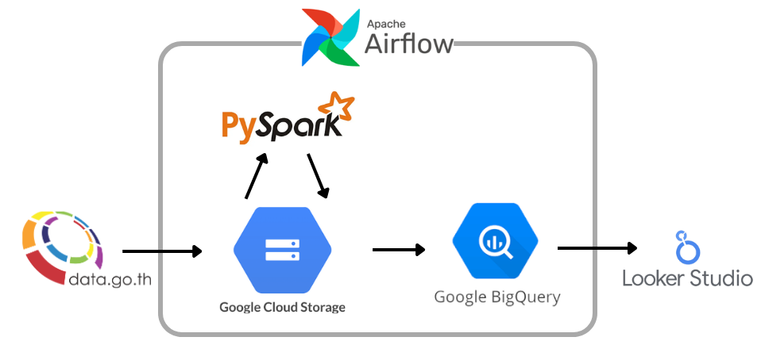
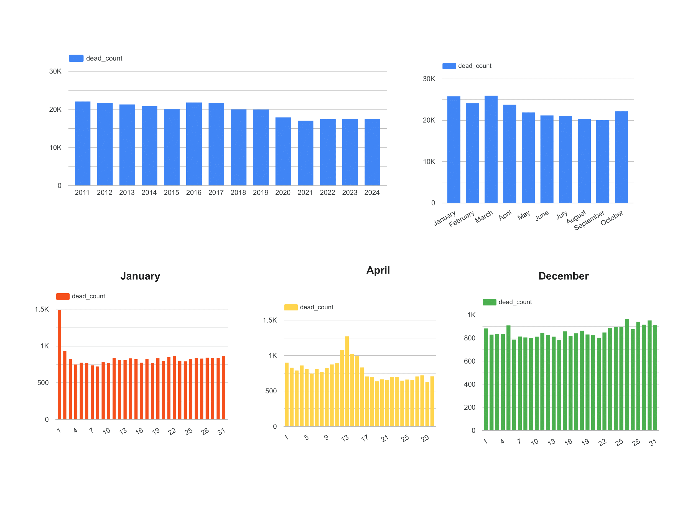
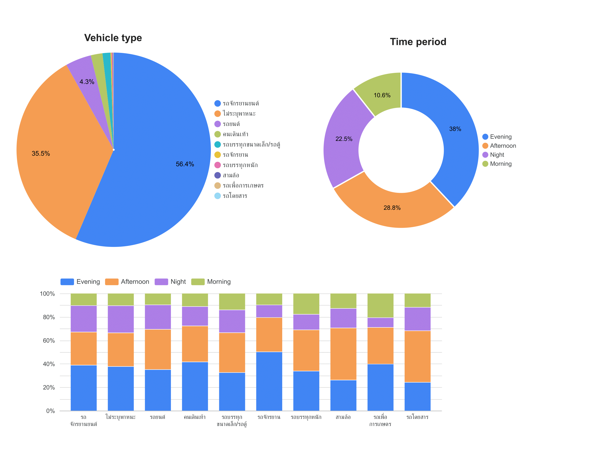
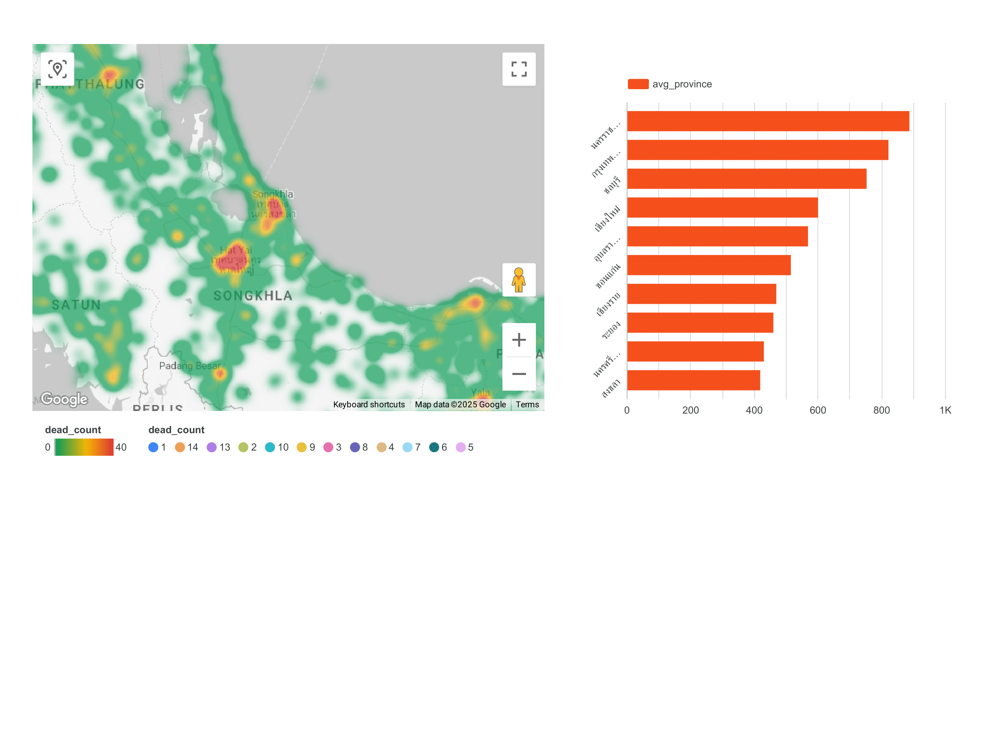

# Road Accident Fatality Data Engineering Project

Developed a comprehensive data engineering pipeline to process and analyze road accident fatality data from Thailand's open data platform [data.go.th](https://data.go.th/dataset/rtddi). This project implements a modern ETL (Extract, Transform, Load) architecture using Google Cloud Platform technologies.

## Report example

