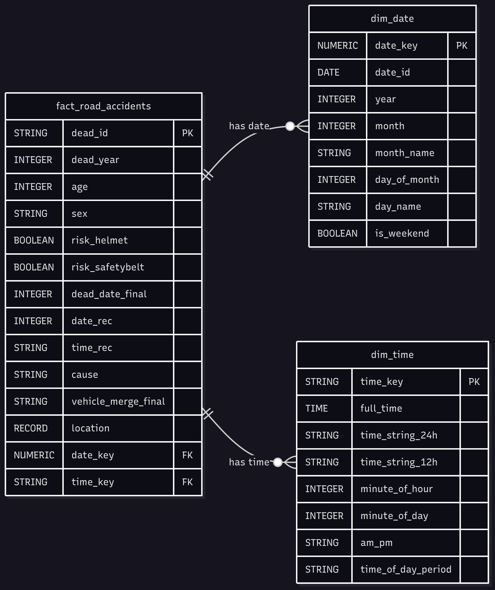

# Road Accident Fatality Data Engineering Project

This project focuses on building a robust data engineering pipeline to process, analyze, and visualize road accident fatality data from Thailand's official open data platform, data.go.th. The goal is to provide actionable insights into road safety trends, contributing to a better understanding of accident patterns and potentially informing prevention strategies.

## Project Overview
In this project, I developed a comprehensive data engineering pipeline to process and analyze road accident fatality data. This modern ETL (Extract, Transform, Load) architecture leverages Google Cloud Platform (GCP) technologies to ensure scalability, reliability, and efficient data processing.

## Why This Project?
I chose this project because road accident data is incredibly relevant and close to everyday life in Thailand. As someone who uses the roads daily, I frequently encounter news and social media discussions about road accidents and their devastating impact. This personal connection drove my interest in understanding the underlying patterns and factors contributing to these incidents. By working with this data, I aim to not only showcase my data engineering skills but also contribute to a deeper understanding of a critical societal issue. The insights derived from this project could potentially highlight key areas for improvement in road safety.

## Project Architecture and Tools

The data pipeline is designed with a focus on automation, scalability, and data integrity.

- **data.go.th (Data Source)**: This is Thailand's official open data platform, serving as the primary source for the road accident fatality data.

- **Apache Airflow**: Chosen for its robust and scalable capabilities to programmatically author, schedule, and monitor complex ETL workflows (DAGs). Its Python-based nature aligns well with PySpark and allows for clear, version-controlled definition of tasks, ensuring reliable and easily monitored pipeline execution.

- **Google Cloud Storage (GCS)**: Leveraged for its highly scalable, durable, and cost-effective object storage to serve as the landing zone for raw data and intermediate storage for processed data. Its seamless integration with other GCP services and serverless nature simplified infrastructure management.

- **PySpark**: Utilized for its powerful distributed processing capabilities to efficiently handle large volumes of road accident data, performing transformations, cleaning, and aggregations. The Python API (PySpark) allowed for flexible and straightforward data manipulation.

- **Google BigQuery**: Selected as the final destination for processed and structured data due to its fully managed, serverless, and highly scalable enterprise data warehousing features. Its exceptional query performance on large datasets, cost-effectiveness, and seamless integration with other GCP services make it ideal for analytical workloads.

- **Looker Studio**: Employed for its intuitive interface to create informative, interactive reports and dashboards directly from BigQuery, enabling easy visualization and sharing of insights.

## Data Modeling

The core of this project's data model is a denormalized fact table in BigQuery, designed for optimal analytical querying.
- **Denormalization**: The fact_road_accidents table is largely denormalized, including attributes like age, sex, cause, and vehicle_merge_final directly. This design is optimized for analytical queries in BigQuery, reducing the need for joins and improving query performance.
- **location as a RECORD**: Geographical information is nested within a RECORD type, a powerful BigQuery feature that allows for hierarchical data representation. This keeps related location details logically together and efficient for querying.
- **Data Types**: Appropriate data types (e.g., STRING, INTEGER, BOOLEAN, FLOAT) are used for each field to ensure data integrity and efficient storage/querying.
- **Dimensional Tables**: the pipeline also generates or leverages dim_date and dim_time tables. These dimensional tables, containing attributes related to dates (e.g., year, month, day, day_of_week) and time (e.g., hour, minute), enhance analytical capabilities. They enable flexible time-based analysis, allowing for insights into trends by year, month, or even specific hours. This design improves query performance by reducing complex date/time calculations on the fact table and ensures consistent date and time representations across all analyses.

## Example Reports

The processed data in BigQuery allows for the creation of various insightful dashboards using Looker Studio. Here are examples of the types of reports that can be generated:

- **Annual Fatality Trends (Top Left)**: This bar chart visualizes the dead_count across different years (2011-2024). It clearly shows the overall trend in road accident fatalities over time, allowing for quick identification of years with higher or lower numbers. This helps in understanding the long-term effectiveness of safety measures.

- **Monthly Fatality Trends (Top Right)**: This chart displays the dead_count by month (January-October), providing insights into seasonal patterns or specific months where fatalities are more prevalent. This can inform targeted campaigns or increased vigilance during certain periods.

- **Daily Fatality Trends (Bottom Row - January, April, December)**: These granular charts break down the dead_count by day of the month for specific months: January, April, and December. These months are particularly relevant as they contain long holidays in Thailand, which often see increased travel and higher accident rates. This detailed view can reveal daily patterns within these critical months, such as higher fatalities on weekends or specific holiday periods, which can be crucial for focused interventions.

